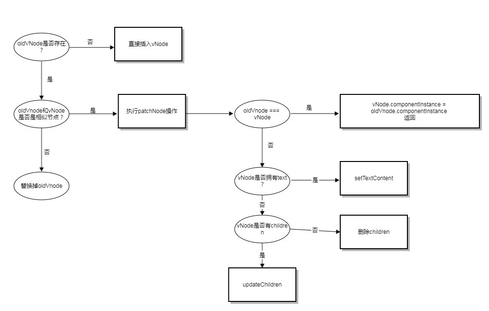

### vitualDom  

由于直接操作dom元素，会带来性能上的浪费，所以引入了vitualDom的概念。vitualDom与真实的dom保持着关系，vitualDom里面包括了dom的类型和属性、上下文等内容： 

    export default class VNode {
        tag: string | void;
        data: VNodeData | void;
        children: ?Array<VNode>;
        text: string | void;
        elm: Node | void;
        ns: string | void;
        context: Component | void; // rendered in this component's scope
        key: string | number | void;
        componentOptions: VNodeComponentOptions | void;
        componentInstance: Component | void; // component instance
        parent: VNode | void; // component placeholder node

        // strictly internal
        raw: boolean; // contains raw HTML? (server only)
        isStatic: boolean; // hoisted static node
        isRootInsert: boolean; // necessary for enter transition check
        isComment: boolean; // empty comment placeholder?
        isCloned: boolean; // is a cloned node?
        isOnce: boolean; // is a v-once node?
        asyncFactory: Function | void; // async component factory function
        asyncMeta: Object | void;
        isAsyncPlaceholder: boolean;
        ssrContext: Object | void;
        fnContext: Component | void; // real context vm for functional nodes
        fnOptions: ?ComponentOptions; // for SSR caching
        devtoolsMeta: ?Object; // used to store functional render context for devtools
        fnScopeId: ?string; // functional scope id support

        constructor (
            tag?: string,
            data?: VNodeData,
            children?: ?Array<VNode>,
            text?: string,
            elm?: Node,
            context?: Component,
            componentOptions?: VNodeComponentOptions,
            asyncFactory?: Function
        ) {
            this.tag = tag
            this.data = data
            this.children = children
            this.text = text
            this.elm = elm
            this.ns = undefined
            this.context = context
            this.fnContext = undefined
            this.fnOptions = undefined
            this.fnScopeId = undefined
            this.key = data && data.key
            this.componentOptions = componentOptions
            this.componentInstance = undefined
            this.parent = undefined
            this.raw = false
            this.isStatic = false
            this.isRootInsert = true
            this.isComment = false
            this.isCloned = false
            this.isOnce = false
            this.asyncFactory = asyncFactory
            this.asyncMeta = undefined
            this.isAsyncPlaceholder = false
        }

        // DEPRECATED: alias for componentInstance for backwards compat.
        /* istanbul ignore next */
        get child (): Component | void {
            return this.componentInstance
        }
    }  

修改数据时，先对vitualDom进行修改，比较前后的虚拟dom树是否有改变，如果有改变，才重新渲染dom。  

### patch  

为了检查虚拟dom树的改变状态，使用了patch方法，在vue中，patch方法的过程如下： 

  

##### 1. 首先检查oldVnode是否存在，不存在的话，直接插入新的节点vnode. 

##### 2. oldVnode和vnode是否时相似节点，这里通过函数``sameVnode``来判断：  

        function sameVnode (a, b) {
            return (
                a.key === b.key && (
                    (
                        a.tag === b.tag &&
                        a.isComment === b.isComment &&
                        isDef(a.data) === isDef(b.data) &&
                        sameInputType(a, b)
                    ) || (
                        isTrue(a.isAsyncPlaceholder) &&
                        a.asyncFactory === b.asyncFactory &&
                        isUndef(b.asyncFactory.error)
                    )
                )
            )
        }

``samVnode``的逻辑比较简单，如果a的key和b的key不一样，则当作两个vnode是不同的；对于同步组件，判断tag、isComment、data、input等类型是否一样；对于异步组件，判断asyncFactory。  

###### 新旧节点不同
如果oldVnode和vnode不是相似节点，则直接用vnode替换掉oldVnode。大概分3步：  

1. 创建新节点  

        // create new node
        createElm(
          vnode,
          insertedVnodeQueue,
          // extremely rare edge case: do not insert if old element is in a
          // leaving transition. Only happens when combining transition +
          // keep-alive + HOCs. (#4590)
          oldElm._leaveCb ? null : parentElm,
          nodeOps.nextSibling(oldElm)
        )  

2. 更新父节点的占位符 

        // update parent placeholder node element, recursively
        if (isDef(vnode.parent)) {
          let ancestor = vnode.parent
          const patchable = isPatchable(vnode)
          while (ancestor) {
            for (let i = 0; i < cbs.destroy.length; ++i) {
              cbs.destroy[i](ancestor)
            }
            ancestor.elm = vnode.elm
            if (patchable) {
              for (let i = 0; i < cbs.create.length; ++i) {
                cbs.create[i](emptyNode, ancestor)
              }
              // #6513
              // invoke insert hooks that may have been merged by create hooks.
              // e.g. for directives that uses the "inserted" hook.
              const insert = ancestor.data.hook.insert
              if (insert.merged) {
                // start at index 1 to avoid re-invoking component mounted hook
                for (let i = 1; i < insert.fns.length; i++) {
                  insert.fns[i]()
                }
              }
            } else {
              registerRef(ancestor)
            }
            ancestor = ancestor.parent
          }
        }  

3. 删除旧节点  

        // destroy old node
        if (isDef(parentElm)) {
          removeVnodes([oldVnode], 0, 0)
        } else if (isDef(oldVnode.tag)) {
          invokeDestroyHook(oldVnode)
        }  

删除逻辑很简单，删除并执行remove钩子函数，并遍历子节点，触发destroy钩子函数，  

###### 新旧节点相同  

执行``patchVnode``函数，  
首先先执行prepatch操作  

    let i
    const data = vnode.data
    if (isDef(data) && isDef(i = data.hook) && isDef(i = i.prepatch)) {
      i(oldVnode, vnode)
    }  

然后判断，vnode中的text是否为空，不为空，代表vnode里面是一个文本节点，直接调用``setTextContent``方法就好；否则，判断新旧节点是否拥有children，如果都有，则执行``updateChildren``；旧节点没有children，直接插入新节点的children即可；新节点没有children，删除旧节点的children。  

##### updateChildren方法  

这个方法是最复杂的。

