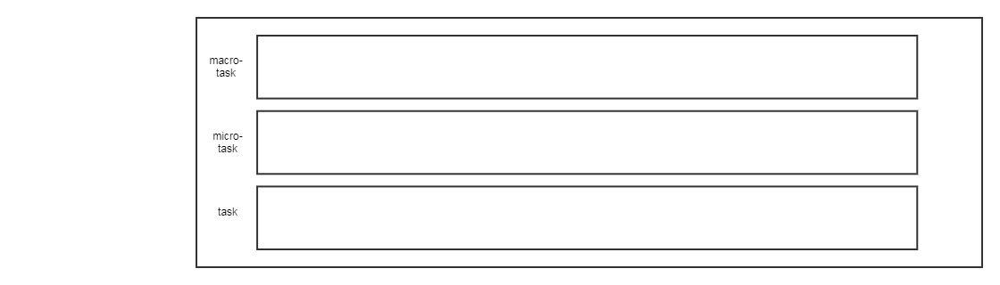
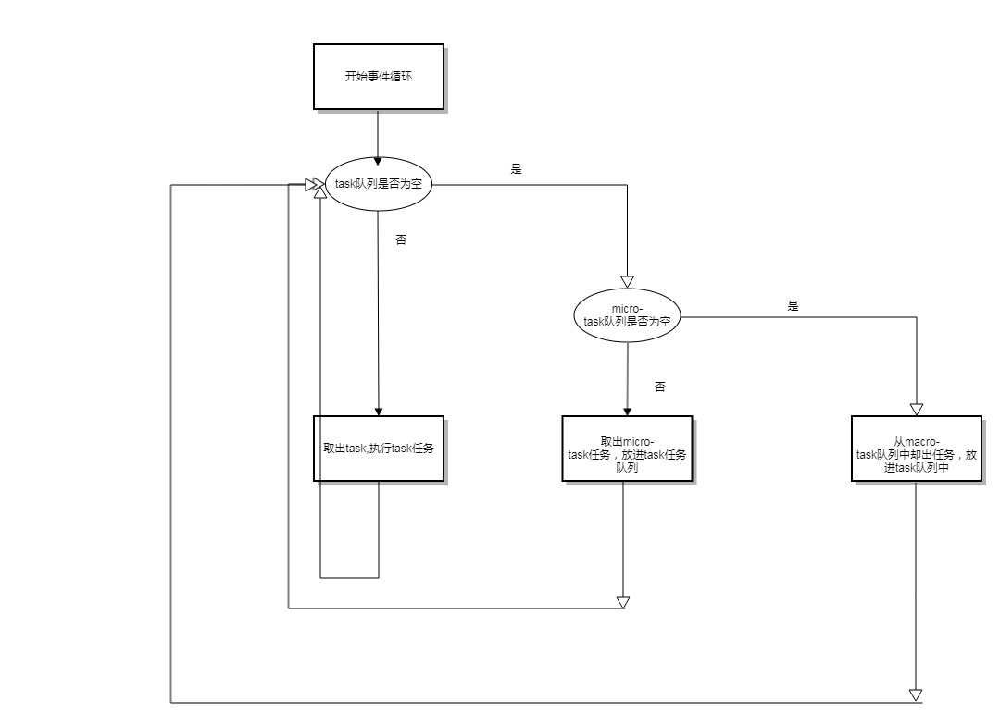
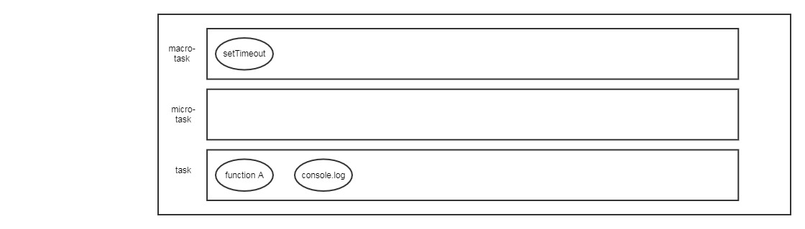
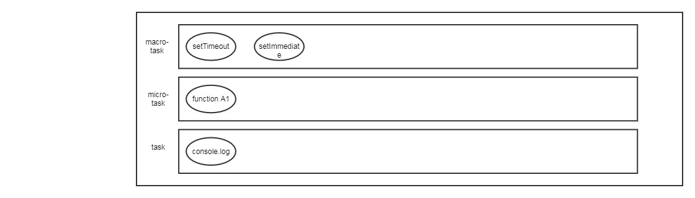
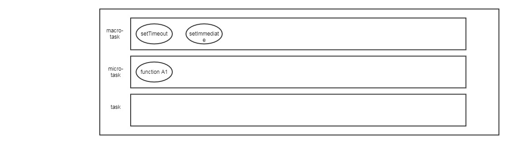
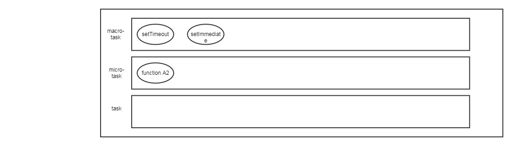
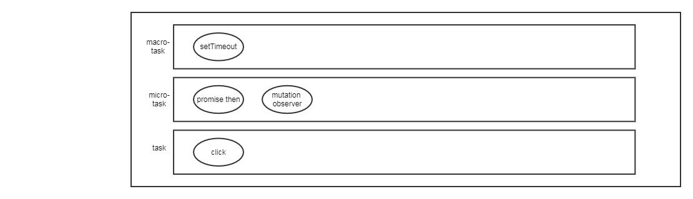
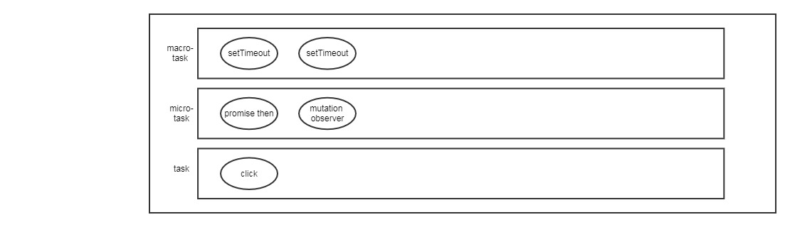
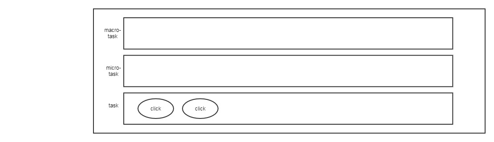

## microtask & macrotask  

- macro-task: 包括``script(整体)``、``setTimeout``、``setImmediate``、``setInterval``、``I/O``、``UI renderiing``  
- micro-task: 包括``process.nextTick``、``Promise``、``MutationObserver``, ``Object.observe``   

每个进程都包含自身的“事件循环”，在事件循环中，进程会每时每刻检查``任务队列（task queues）``，并把任务队列中的任务执行。此外，还包含``macro-task队列``和``micro-task队列``。大概的示意图如下：  

  

当task队列中没有任务的时候，会先从micro-task队列中取出一个事件，放到task队列中，执行，不断循环，直至micro-task队列没有任务，接着把macro-task队列中的任务取出一个事件，放到task队列中。  

下面有一段代码：

    setTimeout(function B () {
        console.log('输出setTimeout');
    }, 0);

    new Promise(function A () {
        console.log('执行promise代码');
        setImmediate(function () {
            console.log('执行promise中的setImmediate代码');
        });
        resolve();
        console.log('执行promise代码2');
    })
    .then(function A1 () {
        console.log('执行promise返回后的代码');
    })
    .then(function A2 () {
        console.log('执行promise返回后的代码2');
    });

    console.log('执行外层代码');

输出的结果是： 
<pre>
console: 
执行promise代码
执行promise代码2
执行外层代码
执行promise返回后的代码
执行promise返回后的代码2
输出setTimeout
执行promise中的setImmediate代码
</pre>  

首先，Promise对象的函数是同步的，而Promise.then返回的是一个异步函数。进程会先把同步事件放到task队列中，此时示意图如下：   

  

执行``function A``，输出控制台：
<pre>
执行promise代码
执行promise代码2
</pre>  

同时，任务队列变成：  

  

接着，task队列取出任务执行，控制台输出：  
<pre>
执行promise代码
执行promise代码2
执行外层代码
</pre>  

同时，任务队列变成：
    

task队列空了，在micro-task队列中，取出``function A1``，并放到task队列中执行。由于，``function A1``还会返回一个Promise对象，所以，把``function A2``放入micro-task队列中。此时，控制台输出：

<pre>
执行promise代码
执行promise代码2
执行外层代码
执行promise返回后的代码
</pre> 

任务队列：
  

接下来，继续执行，把``function A2``取出放到task列表中执行。此时，micro-task队列空了，后面会把macro-task队列一个一个取出，按序执行。最后输出一开始给出的结果。  

### 更复杂的例子  

有一组html元素

<pre>

	父
	
子

</pre> 

为他们添加一组点击事件：

<pre>
var p = document.getElementById('parent'),
    c = document.getElementById('child');

var observer = new MutationObserver(function() {
    console.log("mutated");
}).observe(p, {
    attributes: true
});

p.addEventListener("click", function() {
    console.log("parent click");

    Promise.resolve().then(r => {
        console.log("parent resolve");
    });

    setTimeout(function() {
        console.log("parent setTimeout");
    }, 0);

    console.log("parent end");

    p.setAttribute("data-pa", Math.random());
});

c.addEventListener("click", function() {
    console.log("child click");

    Promise.resolve().then(r => {
        console.log("child resolve");
    });

    setTimeout(function() {
        console.log("child setTimeout");
    }, 0);

    p.setAttribute("data-pa", Math.random());

    console.log("child end");
});
</pre>  

点击child，会在控制台输出：

<pre>
child click
child end
child resolve
mutated
parent click
parent end
parent resolve
mutated
child setTimeout
parent setTimeout
</pre>  

由于点击事件默认采用冒泡的方式，所以，点击child时，会先触发child绑定的点击事件。执行onclick的函数，此时，会把``Promise.then``，``setTimeout``, ``mutation observer``事件分别放进micro-task、macro-task、micro-task队列中。  

  

依次会执行下面步骤：

1. 执行child绑定onclick中的console函数
2. 执行Promise.then
3. 执行mutation observer

当上面执行完毕后，click事件会冒泡给父元素，此时，task队列为：

  

依次会执行：

1. 执行parent绑定onclick中的console函数
2. 执行promise.then
3. 执行mutation observer
4. 执行child中的setTimeout函数
5. 执行parent中的setTimeout函数  

> 但是，如果child的点击事件是通过javascript执行的，比如，在最后添加上``c.click()``，情况会有所不一样。  

最后的输出结果是：

<pre>
child click
child end
parent click
parent end
child resolve
mutated
parent resolve
child setTimeout
parent setTimeout
</pre>

因为，当通过程序控制child点击事件，其实会同步的进行click事件冒泡，所以，此时task队列为：

事件循环会先把task队列中的事件消耗先。同时，由于，执行child的onclick事件时，会产生一个mutation observer,同时，micro-task队列中包含了mutation observer，所以，parent中的mutation observer并不会放入到micro-task队列中。  因此，micro-task中只会有一个mutation observer任务。  

### setTimeout/setImmediate  

如果两者在主线程中，执行的先后顺序取决于机器性能  
如果两者在poll阶段（非主线程/异步回调函数里），setImmediate的执行由于setTimeout

[参考博客](https://jakearchibald.com/2015/tasks-microtasks-queues-and-schedules/)