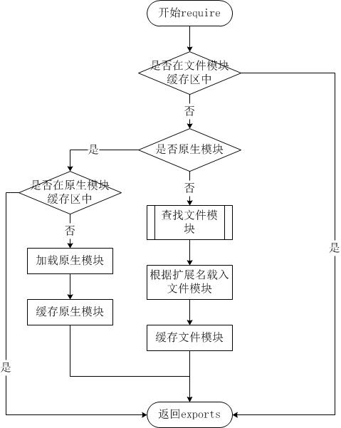

# javascript模块加载  

## CommonJs

### CommonJs的规范：

- 一个文件就是一个模块，拥有单独的作用于
- 普通方式定义的变量、函数、对象都属于该模块内
- 通过require来加载模块
- 通过exports和module.exports来暴露模块中的内容  
- 只有加载完，才会继续后面的操作  

### CommonJS模块加载过程

CommonJs是同步加载机制，只有加载完后，才会继续下面的操作。CommonJs只从文件中加载一次，后面的加载，会从缓存中加载。  

CommonJS中，模块分为系统模块、文件模块两大类。  

- 原生模块： fs、path、url等，已经编译好的模块，加载速度快。  
- 文件模块： 自己编写的模块或第三方模块。  

CommonJS加载的过程大致如下：  

  

### CommonJs模块加载路径  

CommonJs加载文件时，会根据路径进行搜索。 

例子：当前文件``/home/toreant/run.js``，引用如下模块；

如果是相对路径，比如：``require('./moduleA')``。搜索的顺序如下：  

1. 搜索当前目录下是否有``/home/torent/moduleA.js``、``/home/toreant/moduleA.json``、``/home/toreant/moduleA.node``，以js、json、node顺序查找，如果找到了，就终止
2. 如果没有，则搜索``/home/toreant/moduleA``文件夹中是否有``package.json``，同时，文件里面是否包含着main字段，如：``{"main": "main.js"}``，则加载``/home/toreant/moduleA/main.js``
3. 如果上面还是没有，则搜索``/home/toreant/moduleA/index.js``

如果是绝对路径，比如：``require('moduleB')``。

1. ``/home/toreant/node_modules/moduleB.js``
2. ``/home/toreant/node_modules/moduleB``中的package.json，里面是否包含main，同时main所指向的文件存在
3. ``/home/toreant/node_modules/moduleB/index.js``  
> 如果上面都没有，则会往上一级搜索。  

### exports和module.exports  

module是一个变量，exports是另一个变量。module.exports和exports初始都是指向同一个对象``{}``。可以同时修改同一个对象的同一个属性，但是只读最后一次修改。  

比如：  

    exports.A = 1;
    module.exports.A = 2;
    // 最后此模块输出{A: 2}

module.exports可以修改成指向另一个对象。

    module.exports = {
        A: 1
    };
    exports.A = 2;
    // 最后此模块输出{A: 1}

说明，导数的模块，以module.exports所指向的对象为准。

## AMD  

AMD使用的是requirejs，模块加载是通过异步加载的方式，加载完模块后，再进行回调操作。  

比如，定义一个模块  

    define(['moduleA'], function (moduleA) {
        // 表示当前模块，引用了模块moduleA   
    });

