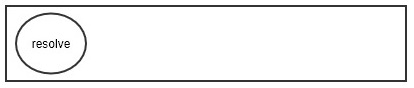
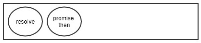
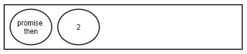
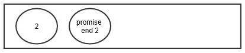

先看一下题：  

```javascript
console.log('script start');

setTimeout(console.log, 0, 'setTimeout')

async function fn1() {
    await fn2();
    console.log(await Promise.resolve('2'))
    console.log('fn1 end')
}

async function fn2() {
    console.log('fn2 end')
}

fn1()

new Promise(resolve => {
    console.log('promise resolve')
    resolve()
})
.then(r => {
    console.log('promise then')
    return
})
.then(_ => {
    console.log('promise end 2')
})

console.log('script end')
```  

你觉得输出的答案是什么呢？  

在最新的chrome浏览器和node12中运行，得到的结果都是：  

```shell
script start
fn2 end
promise resolve
script end
promise then
2
fn1 end
promise end 2
setTimeout
```  

我们先理解一下，事件会先执行完micro-task队列，才会去执行macro-task队列。所以``setTimeout``最后，这个是没有疑问的。  

从程序往下执行，所以会输出主程序的内容:

```shell
script start
```

然后，来到了``fn1()``。这时候，遇到``await fn2()``。  

我们先来回顾async和await：  

> async function 用来定义一个返回 AsyncFunction 对象的异步函数。异步函数是指通过事件循环异步执行的函数，它会通过一个隐式的 Promise 返回其结果。如果你在代码中使用了异步函数，就会发现它的语法和结构会更像是标准的同步函数。
>  
> 异步函数可以包含await指令，该指令会暂停异步函数的执行，并等待Promise执行，然后继续执行异步函数，并返回结果。  
> 
> 注意，当异步函数暂停时，它调用的函数会继续执行(收到异步函数返回的隐式Promise)  

好了，所以fn1函数里，会先等待fn2的函数执行，结果输出``fn2 end``。同时，会返回一个promise，进入micro-task队列。 结果：  

```shell
script start
fn2 end
```

  

此时程序跳出了fn1函数，进行主程序。执行``new Promise``函数。``new Promise``函数是同步的逻辑，

```shell
script start
fn2 end
promise resolve
```  

同时，由于内容``resolve()``了，所以，会把then的内容放到micro-task中。

  

继续执行主程序内容，

```shell
script start
fn2 end
promise resolve
script end
```  

好了，主程序没有内容了，事件循环就从micro-task取出任务，``resolve()``，接着，把下面的``await Promise.resolve(2)``放到micro-task中。

 

继续，从micro-task中取出任务，并把下面的promise推到micro-task中，输出

```shell
script start
fn2 end
promise resolve
script end
promise then
```  



哈哈，又要从micro-task中取出任务了，此时会输出2，同时，会执行下面的同步逻辑。

```shell
script start
fn2 end
promise resolve
script end
promise then
2
fn1 end
fn1 end2
```

最后，micro-task中只剩下一个任务了，

```shell
script start
fn2 end
promise resolve
script end
promise then
2
fn1 end
fn1 end2
promise end 2
```

micro-task中队列为空了，事件循环终于有空处理macro-task了，哈哈哈，真是贵人事忙。最总结果：

```shell
script start
fn2 end
promise resolve
script end
promise then
2
fn1 end
fn1 end2
promise end 2
setTimeout
```