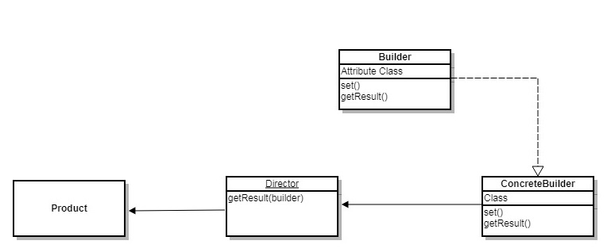

## 建造者模式 

- 每个产品需要有许多共同点 
- 消费者不需要了解具体建造过程
- 易于拓展新的产品  

  

> Builder: 抽象建造器，负责抽象建造的方法。    
> ConcreteBuilder: 具体的建造器，继承Builder，负责实例化建造器的方法。可以根据不同的产品构造不同的ConcretBuilder   
> Director: 导演，负责具体的建造过程。  
> Production: 最后的产品   

    // Director
    class Director {
        getResult(builder) {
            builder.setHead();
            builder.setBody();
            builder.setFooter();
            return builder.getResult();
        }
    }  

    // Builder
    let head = '';
    let body = '';
    let footer = '';

    class Builder {
        getHead() {
            return head;
        }

        getBody() {
            return body;
        }

        getFooter() {
            return footer;
        }

        setHead(h) {
            head = h;
        }

        setBody(b) {
            body = b;
        }

        setFooter(f) {
            footer = f;
        }

        getResult() {
            return {
                head: head,
                body: body,
                footer: footer
            };
        }
    }  

    // ConcreteBuilder
    class Man extends Builder {
        setHead() {
            super.setHead('聪明的头脑');
        }

        setBody() {
            super.setBody('健壮的身躯');
        }

        setFooter() {
            super.setFooter('修长的大腿');
        }

        getResult() {
            let result = super.getResult();
            return Object.assign({}, result, {
                desc: '这个是创建的人类'
            });
        }
    }  

    // 最后用户需要的结果
    let production = new Director().getResult(new Man());  

### 优点  

1. 易于扩展。如果需要增加新的产品类别，只需要新建一个ConcreteBuilder，继承Builder，并实例化产品的方法。
2. 解耦。用户不需要知道具体的产品构建过程。
3. 各个产品之间相对独立，只需要针对每个每个产品进行具体的细节改造。  

### 缺点  

1. 每个产品需要有许多共同点。
2. 产品的改造细节，容易导致代码臃肿。  

以上面例子，如果我需要增加一个新的产品，叫做SuperMan，同时，我还需要增加服装、能力。这时，我需要对Builder进行抽象方法的添加，还需要对Director构建过程进行改造。如果后面有更多新的产品有新的特点，建造者模式就不适合了。

